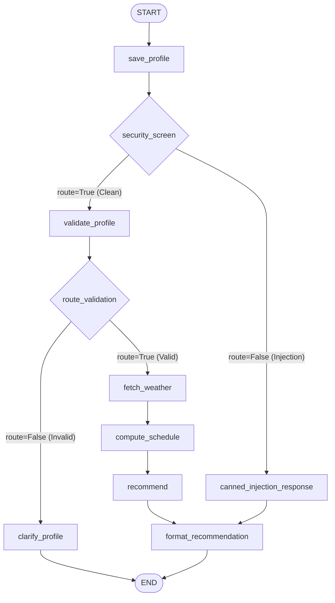

# Irrigation Optimizer Agent

The **Irrigation Optimizer Agent** is an AI-powered agronomy advisor designed to help farmers optimize their crop watering schedules. It implements the **FAO-56 Dual Crop Coefficient Water Balance Model**, fetching real-time 7-day weather forecasts (precipitation and FAO-56 reference evapotranspiration ET0) from the Open-Meteo API, calculating daily crop water needs, and delivering actionable irrigation recommendations.

---

## 📐 System Architecture

The agent is built using the **Google ADK (Agent Development Kit) 2.0** framework, orchestrating structured data processing and LLM-based reasoning via a directed graph workflow.

### Graph Workflow Diagram



### Components Details:
1. **Nodes**:
   - `save_profile`: Parses and saves the farmer's crop details to the session state.
   - `security_screen`: Uses regex rules to screen incoming user queries for prompt injection patterns.
   - `validate_profile`: An LLM-agent node verifying if crop type, coordinates, field size, and planting date are present and valid.
   - `route_validation`: Directs clean flows to fetch weather data or routes to clarifying nodes if data is missing.
   - `fetch_weather`: Calls the Open-Meteo API to obtain daily ET0 and precipitation forecast data.
   - `compute_schedule`: Runs the local `irrigation-calculator` script via a subprocess to compute daily net irrigation needs.
   - `recommend`: An LLM-agent node formatting raw numeric schedules into user-friendly advice.
   - `format_recommendation`: Finalizes the output and manages PII consent persistence.
2. **Session Memory**: Handled by ADK's `Context` state. State values are dynamically saved and loaded across multi-turn sessions (e.g. accumulating profile inputs).
3. **Agent Skills**: Custom modules (`crop-profile` for FAO-56 stages and `irrigation-calculator` for water balance math) called by workflow nodes.

---

## 🚀 Setup and Run Instructions

### Prerequisites
1. **Python 3.12+**
2. **uv**: Install the Astral python packager ([Install Instructions](https://docs.astral.sh/uv/getting-started/installation/)).
3. **agents-cli**: Install the cli tool:
   ```bash
   uv tool install google-agents-cli
   ```
4. **Google Cloud SDK**: Install the gcloud CLI tool and authenticate:
   ```bash
   gcloud auth login
   gcloud auth application-default login
   ```

### Local Setup
1. Clone the repository and install dependencies:
   ```bash
   agents-cli install
   ```
2. Create a local `.env` file in the root directory:
   ```env
   GEMINI_API_KEY=your-api-key-here
   GOOGLE_GENAI_USE_ENTERPRISE=FALSE
   ```

### Running Locally
*   **Playground Web UI**: Run the local interactive UI to chat with the agent:
    ```bash
    agents-cli playground
    ```
*   **Pytest Suite**: Execute unit and integration tests:
    ```bash
    uv run pytest tests/unit tests/integration
    ```

---

## ☁️ Vertex AI Agent Runtime Deployment

The agent is fully deployable to **Vertex AI Agent Runtime (Reasoning Engines)**.

### Configuration Files
- **`agents-cli-manifest.yaml`**: Defines deployment target (`agent_runtime`), region (`us-east1`), and packaging source directory (`app`).
- **`uv.lock` / `pyproject.toml`**: Pins deterministic dependency versions.

### Environment Variables
- **`GOOGLE_GENAI_USE_ENTERPRISE=TRUE`**: Set automatically in the Reasoning Engine environment. This forces the GenAI SDK to switch from AI Studio/API Key auth to Vertex AI service-account authentication.
- **`GOOGLE_CLOUD_LOCATION=us`**: Overridden to `us` multi-region. Discrete locations like `us-east1` or `us-central1` do not host the `gemini-3.1-flash-lite` model, so setting this variable to `us` is required to resolve the model name on Vertex AI.

### Deployment Commands
1. **Dry-run check**:
   ```bash
   agents-cli deploy -n
   ```
2. **Deploy to production**:
   ```bash
   agents-cli deploy --no-wait --update-env-vars GOOGLE_CLOUD_LOCATION=us --project <GCP_PROJECT_ID> --no-confirm-project
   ```
3. **Check status of asynchronous deploy**:
   ```bash
   agents-cli deploy --status
   ```

---

## 🎓 Demonstrated Course Concepts

- **Agent/Multi-agent system (ADK 2.0 graph Workflow)**: Implemented as a directed graph workflow orchestrating structured state validation, weather retrieval, and natural language communication via node-to-node routing.
- **Security features (security_screen, output cap, CONTEXT.md)**:
  - `security_screen` node blocks prompt injections at the entry gate.
  - A maximum ceiling cap (`MAX_DAILY_MM = 60.0` mm) prevents overflow irrigation suggestions in `calc_schedule.py`.
  - Guidelines are aligned with model boundaries.
- **Agent Skills (irrigation-calculator, crop-profile)**: Custom local tools. `crop-profile` provides FAO-56 crop coefficients (Kc) for growth stages, and `irrigation-calculator` computes the crop water balance.
- **Deployability (Vertex AI Agent Runtime)**: Verified by compiling and packaging the app logic into a Vertex AI Reasoning Engine service account-authenticated endpoint.
